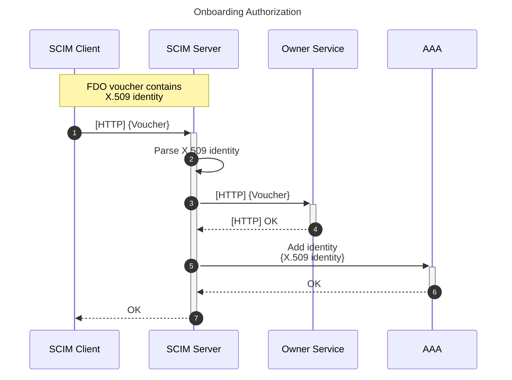
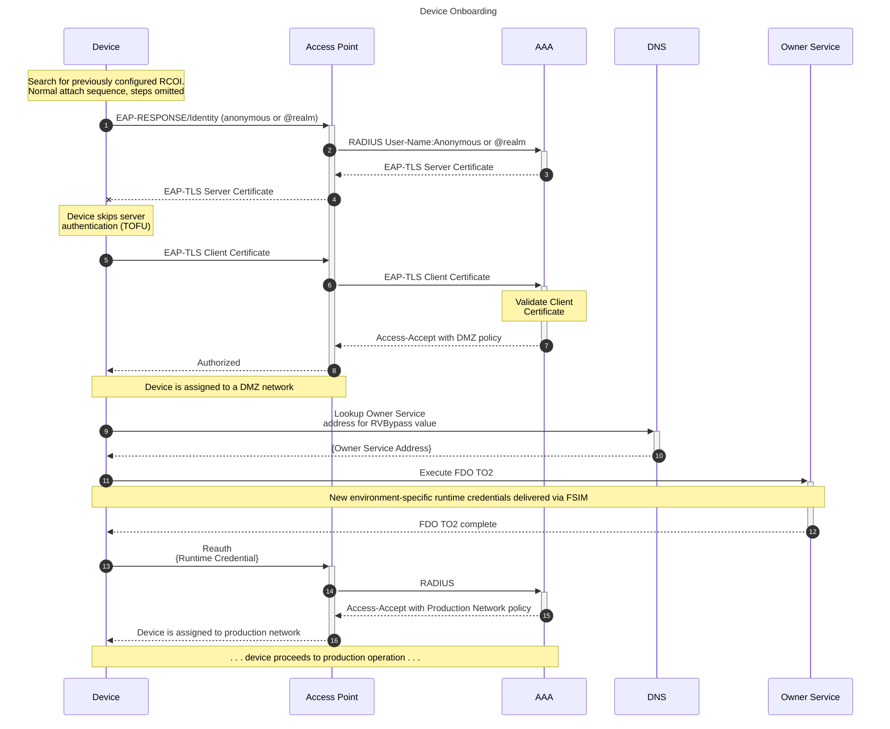
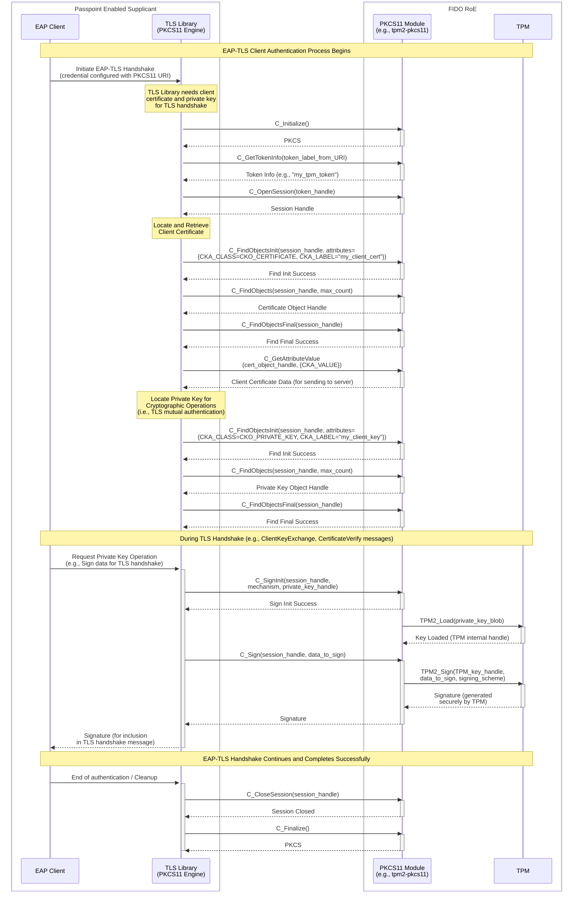

# Workflows

## Pre-requisite Setup

These steps are required as an initial setup of environment dependencies to be able to deploy systems as described in the next section.

### OEM

The Original Equipment Manufacturer (OEM) is responsible for installing and configuring an FDO Manufacturer Service instance that will execute the [FDO Device Initialize (DI) protocol](https://fidoalliance.org/specs/FDO/FIDO-Device-Onboard-PS-v1.1-20220419/FIDO-Device-Onboard-PS-v1.1-20220419.html#device-initialize-protocol-di).  The OEM will execute this process in its local environment, after which the resulting FDO Vouchers will be transferred to administrators of the destination environment through any reasonable means.

### FDO Manufacturer Service

It is the responsibility of the FDO manufacturing service implementor to provide the below described functionality:

While executing FDO DI, an X.509 full identity chain (Root, Intermediates, and End-Entity) MUST be added to the [FDO Ownership Voucher OVDevCertChain](https://fidoalliance.org/specs/FDO/FIDO-Device-Onboard-PS-v1.1-20220419/FIDO-Device-Onboard-PS-v1.1-20220419.html#OwnershipVoucher) field. The public key of the End-Entity certificate corresponds to the private key configured in the devices Restricted Operating Environment (ROE). The End-Entity certificate in the [FDO Device Credential](https://fidoalliance.org/specs/FDO/FIDO-Device-Onboard-PS-v1.1-20220419/FIDO-Device-Onboard-PS-v1.1-20220419.html#DeviceCredential) will be used for EAP-TLS. The ROE MUST support the identification of certificates and keys using the PKCS#11 URI (RFC7512).

Additionally, the FDO Device Credential MUST include a well-known Roaming Consortium Organization Identifier (RCOI). It MAY also include a realm to be used when creating and EAP-Response/Identity message.  These settings SHOULD be configuration parameters for an OEM or equivalent to set when deploying the service that implements the Device Initialize protocol.  The FDO RendezvousDirective MUST include a well-known Fully Qualified Domain Name (FQDN) such as `fdo-owner-service.local`.

### FDO Client and Owner Service

The device recovers the well-known RCOI from the FDO Device Credential and configures its Passpoint-enabled supplicant with the RCOI and the PKCS#11 URI(s) of the End-Entity certificate and private key stored in the ROE. The supplicant uses standard Passpoint functionality to search for Wi-Fi networks that match the RCOI.

Once a suitable network has been identified, the supplicant is responsible for starting an authentication exchange, using the PKCS#11 URI to access the End-Entity certificate and Prvate key stored in the Device Credential for performing EAP-TLS authentication.

If configured with an optional realm parameter, the Supplicant (client) creates an EAP-Response/Identity of "@realm". The Supplicant MUST be configured to skip EAP server verification to allow for Trust-On-First-Use (TOFU).

The FDO Client and FDO Owner Service MUST include FDO ServiceInfo Module (FSIMs) to transfer network credentials that will be used by the device after TO2 completes.  The storage and protection of this credential is at the discretion of the implementor.  For the purposes of the demonstration the ROE will be used to re-authenticate to the production network using the newly received runtime credentials.

More complete operational implementations may employ methods to load a new operating system that accesses runtime network credentials from persisted storage, perhaps from a TPM with appropriately configured access policies.

### Environment

The administrators of an environment are responsible for initial SCIM server, access point (AP) and RADIUS server setup and configuration.  During this process the APs must be configured with the RCOI used by the [OEM](#oem) when executing the FDO DI protocol.

The environment SHOULD be configured with an DMZ/Quarantine network that restricts the client communication to DNS and the FDO Owner Service.

In lieu of using a rendezvous service, the DNS server MUST respond to a queries for the well-known RVBypass value set by the [OEM](#oem) when executing the FDO DI protocol.

After successful onboarding (completion of [FDO TO2](https://fidoalliance.org/specs/FDO/FIDO-Device-Onboard-PS-v1.1-20220419/FIDO-Device-Onboard-PS-v1.1-20220419.html#TO2)) the environment SHOULD provide a separate network with access required for the device to perform its normal production function.

## Deployment

An administrator of the environment must add the FDO voucher to the SCIM server using a SCIM client.  This process could be optionally orchestrated between trusted entities, such as a device manufacturer procurement system programmatically adding a system to a customer's infrastructure through previously configured credentials.

After the FDO voucher has been added to the destination environment the device itself can be onboarded.

If the device is connected to the environment prior to the voucher being added to the FDO Owner Service, it MAY continuously attempt to complete onboarding.

---

### PKCS#11 URI integration

The PKCS#11 URI provides the necessary abstraction, allowing the Supplicant, operating outside of the RoE, to leverage the hardware-backed security of a TPM for EAP-TLS authentication without direct knowledge of the TPM's low-level specifics.
The sequence diagram below illustrates the API calls between TLS library (e.g., openSSL or WolfSSL, acting as the cryptographic library for the Supplicant) and the TPM that is enhanced with PKCS#11 module capability (e.g., using tpm2-pkcs11).

